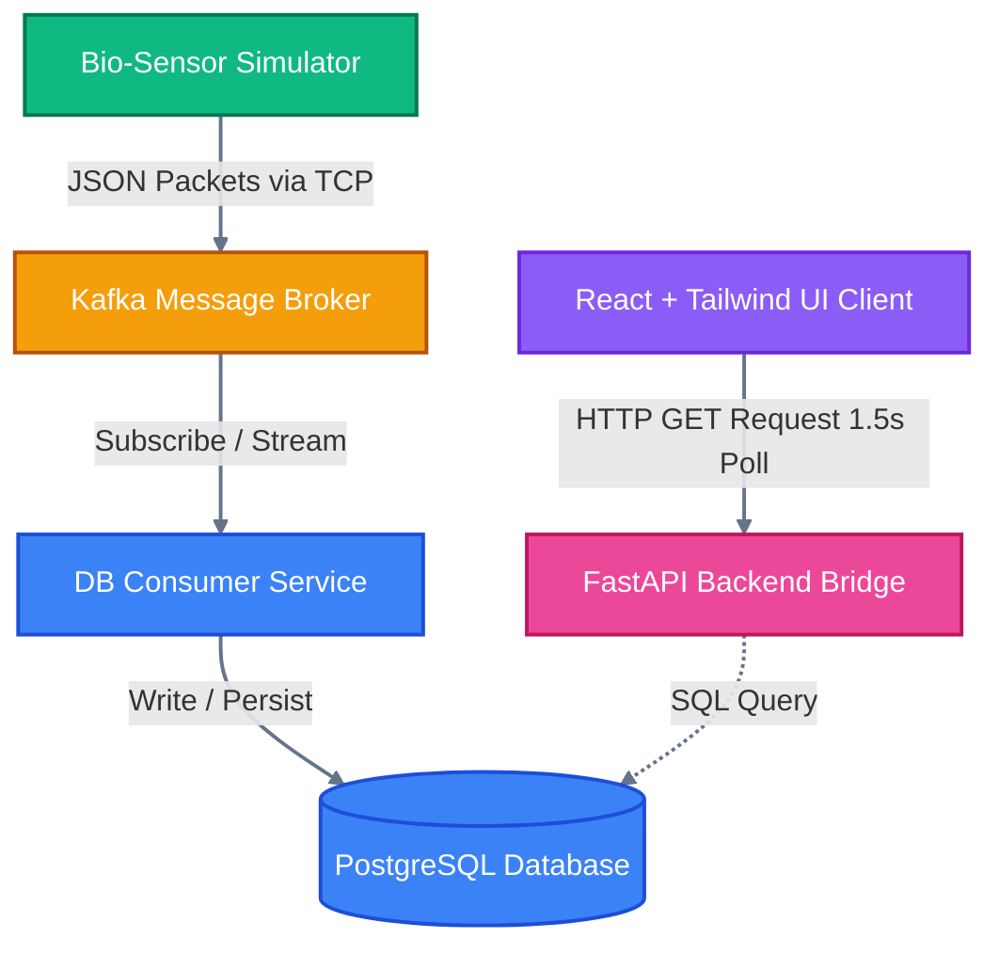
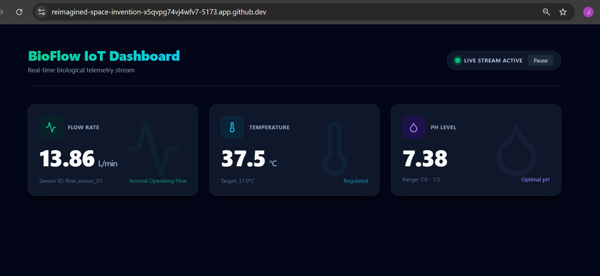

# BioFlow IoT Telemetry Pipeline 

An end-to-end real-time data engineering pipeline that simulates biological sensor telemetry (Flow Rate, Temperature, pH), streams the messages through an event broker, archives them in a relational database, and exposes them via a high-performance API to a modern React dashboard.

---

## System Architecture & Data Flow

This diagram illustrates how data flows seamlessly from the physical (simulated) bio-sensors all the way to the frontend client:



---

## 🖥️ The Live Dashboard

Here is a live look at the telemetry interface pulling real-time bioreactor metrics:



---

## Technology Stack

| Layer | Technology | Purpose |
|---|---|---|
| Sensor Simulator | Python | Mocking real-time bioreactor fluctuation |
| Message Broker | Apache Kafka | Event streaming orchestration |
| Database Consumer | Python | Consuming and translating messages |
| Database | PostgreSQL | Relational storage with timestamp indexes |
| Backend Bridge | FastAPI | High-speed, auto-documented endpoints |
| Frontend UI | React, Tailwind CSS v4, Lucide Icons | Responsive, polling metrics dashboard |

---

##  Getting Started

### Prerequisites

Ensure you have Python 3.12+, Node.js (v18+), Kafka, and PostgreSQL running.

### 1. Start the Infrastructure Services
Before running the application scripts, boot up the background database and message broker containers using Docker Compose:

```bash
docker-compose up -d

```bash
# Terminal 1: Run the simulator
python sensor_simulator.py

# Terminal 2: Run the database archiver
python db_consumer.py

# Terminal 3: Run the FastAPI server
uvicorn app:app --reload --port 8000
```

### 2. Run the React Frontend

```bash
cd frontend
npm run dev
```

---

##  API Endpoints (FastAPI)

- `GET /api/telemetry` — Retrieve the latest 50 historical records.
- `GET /api/telemetry/latest` — Fetch the single most recent biological data packet.
- `/docs` — Access the interactive Swagger UI testing playground.